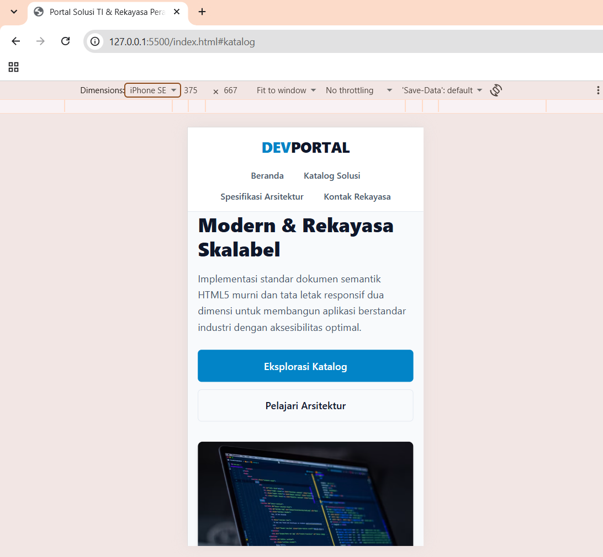
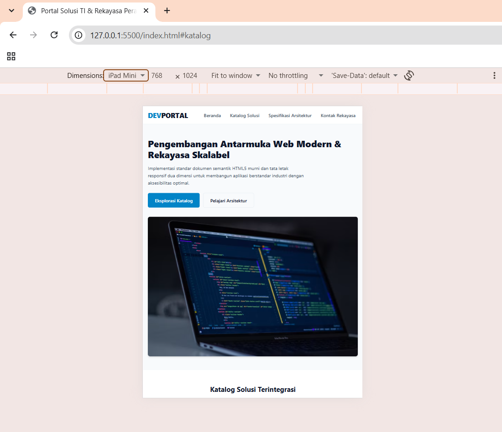
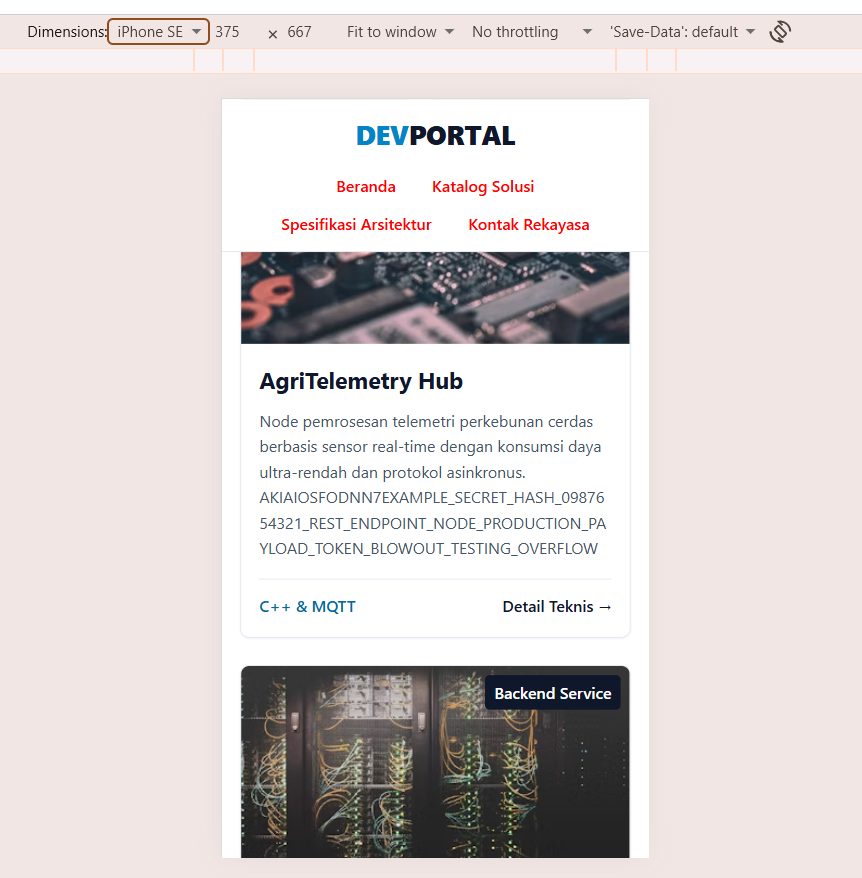
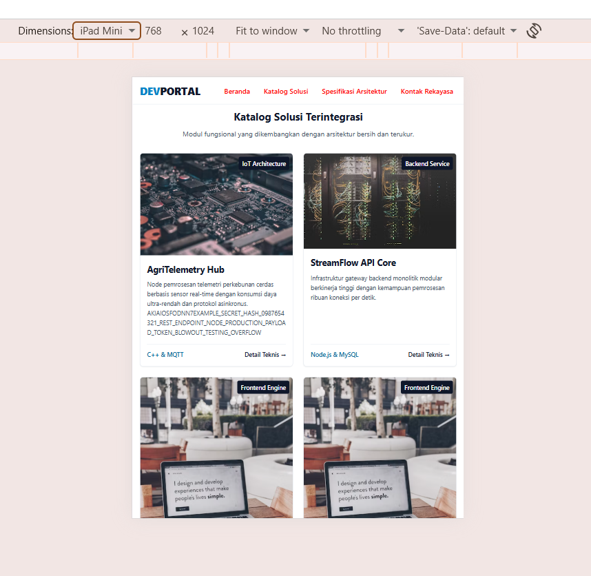
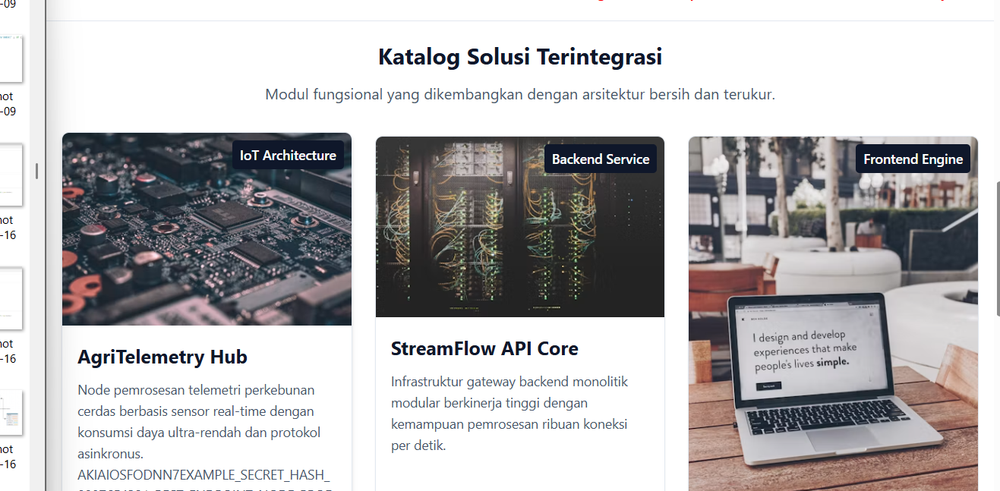
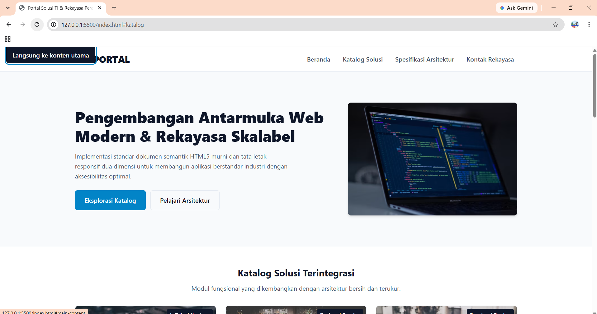
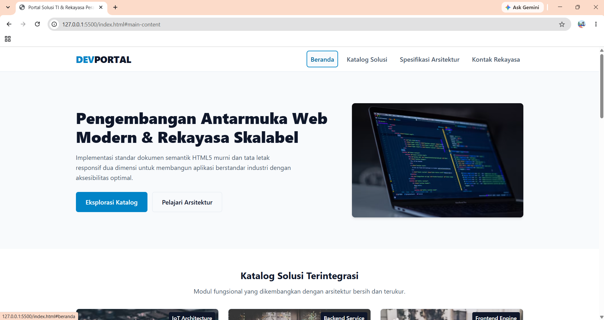

# Pratikum Rekayasa Antarmuka Web #

Nama: Ardelia Naenda Ahmadi
NIM: 42530022

| ID Uji | Fitur/Komponen | Lebar Viewport | Pengujian | Ekspektasi Tampilan Antarmuka | Hasil Pengujian Aktual | Status | Bukti Tangkapan Layar |
|---|---|---|---|---|---|---|---|
| TC-01 | Navigasi Menu | Mobile (360px – 480px) | Menu membungkus (wrap) pada ukuran mobile | Menu membungkus (wrap) rapi, tidak terpotong, teks terbaca proporsional | Sesuai ekspektasi | Pass |  |
| TC-02 | Hero Section | Breakpoint Tablet (768px) | Menguji perubahan layout pada ukuran tablet | Berubah dari susunan 1 kolom vertikal menjadi tata letak seimbang | Sesuai ekspektasi | Pass |  |
| TC-03 | Grid Katalog | Resize Dinamis (360px – 1920px) | Menguji perubahan jumlah kolom pada berbagai ukuran viewport | Kolom bertambah otomatis secara fluid tanpa kemunculan horizontal scrollbar | Sesuai ekspektasi | Pass |    |
| TC-04 | Navigasi Keyboard | Papan Ketik (Tombol Tab) | Menguji navigasi menggunakan keyboard | Skip-link muncul di sudut kiri atas saat menerima fokus pertama kali | Sesuai ekspektasi | Pass |   |